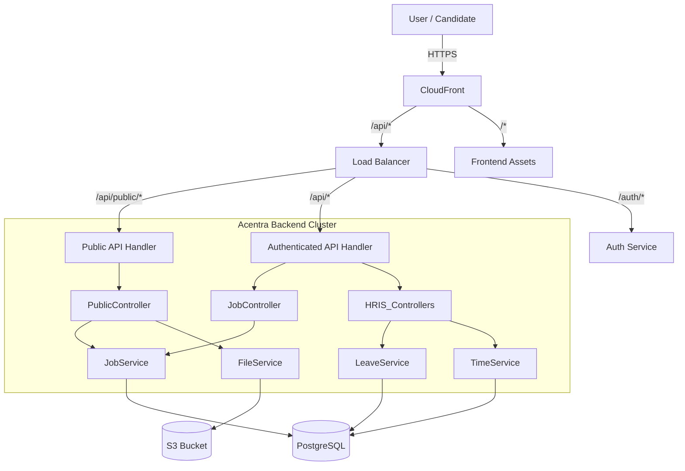

# Architecture Design: Acentra 2.0 (Public Features & HRIS)

## 1. System Overview
Acentra 2.0 expands the platform from a private, multi-tenant ATS into a public-facing recruitment portal and a comprehensive HRIS. The architecture leverages the existing microservices-inspired monolith (Nx Monorepo) but introduces new public boundaries and data modules.

## 2. High-Level Architecture Diagram

## 3. Key Architectural Decisions

### 3.1 Public vs Private API Separation
*   **Strategy**: Instead of a separate microservice, we will use **Router-level segregation** within `acentra-backend`.
*   **Implementation**:
    *   `/api/v1/*` -> Requires `Bearer Token` (Existing).
    *   `/api/public/*` -> No User Auth (Rate Limited).
    *   **Public API Security**:
        *   **Rate Limiting**: Strict `express-rate-limit` on public routes (e.g., 60 req/min for Listings, 5 req/min for Applications).
        *   **Input Sanitization**: Strict Zod validation to prevent injection on public forms.

### 3.2 Data Modeling Changes

#### 3.2.1 ATS Core
*   **`Job` Entity**:
    *   Add `status` Enum: `DRAFT` | `PENDING_APPROVAL` | `OPEN` (Public) | `CLOSED`.
    *   Add `published_at` (Timestamp).
    *   Add `slug` (String, unique per tenant) for SEO-friendly URLs.

#### 3.2.2 HRIS Modules (New Tables)
*   **Leave**:
    *   `LeavePolicy`: Rules engine (Days allowed, Carry forward).
    *   `LeaveRequest`: Transactional table (User, Dates, Type, Status).
    *   `LeaveBalance`: Caching table for performance (User, Year, Remaining Days).
*   **Time**:
    *   `Project`: Charge codes for time.
    *   `TimeEntry`: Daily log (User, Project, Hours, Description).
    *   `Timesheet`: Weekly aggregate for approval.

### 3.3 Frontend Architecture
*   **Layout Separation**:
    *   `AuthenticatedLayout`: Sidebar, Topbar, User Context (Existing).
    *   `PublicLayout`: Minimal header, Tenant Branding support (Logo, Color).
*   **State Management**:
    *   Continue using **React Query** for data fetching (caching public jobs is critical).
    *   No persistent Auth state needed for Public routes.

### 3.4 Infrastructure & Storage
*   **Object Storage (S3)**:
    *   **Bucket Policy Update**:
        *   `resume/`: Private (Only HR can read).
        *   `assets/`: Public Read (Company Logos, Job Description Attachments).
    *   **Upload Flow**:
        *   Candidates upload Resumes -> Backend presigned URL (Write Only) -> S3.
        *   This prevents public write access to the bucket directly.

## 4. Scalability Strategy
*   **Read-Heavy Public Pages**:
    *   If traffic spikes on `/careers`, we implement **Cache headers (`Cache-Control`)** on the `GET /public/jobs` endpoints.
    *   CDN (CloudFront) can cache these JSON responses for 60s-5m to offload the backend.
*   **Database**:
    *   HRIS (Time tracking) creates high write volume.
    *   Plan: Index `user_id` and `date` columns heavily. Partition `time_entries` table by Year if growth exceeds 1M rows.

## 5. Security & Compliance
*   **GDPR/Privacy**:
    *   Public applications collect PII (Personal Identifiable Information).
    *   Add "Consent Checkbox" to Application Form.
    *   Data Retention Policy: Auto-delete rejected candidate data after X months (Configurable).
